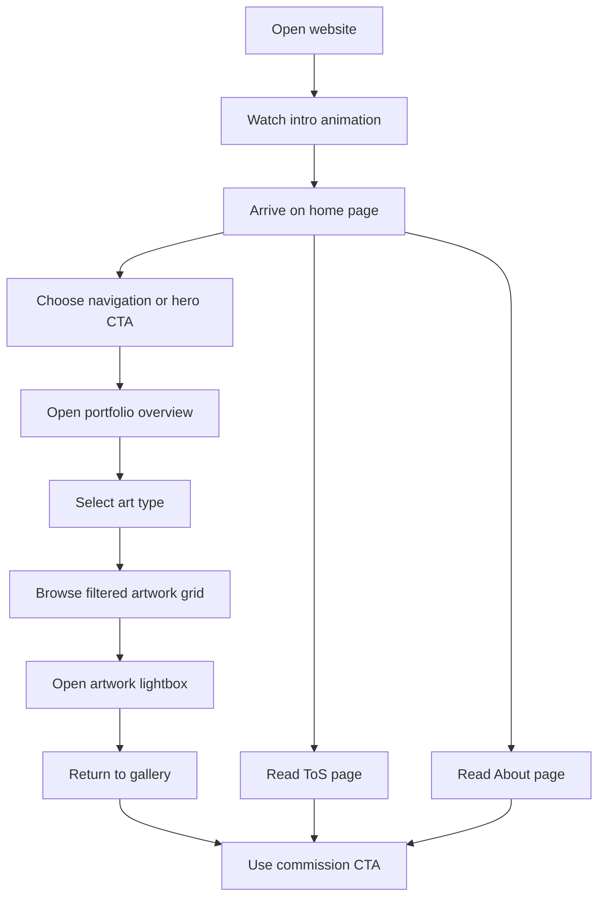

## 1. Product Overview
52hertz is a refined artist portfolio website built to present commission-based artwork in a premium, elegant, and highly curated way.
- The product helps visitors explore artwork by type, understand commission policies, and learn about the artist through a smooth, editorial-style browsing experience.
- The value lies in converting portfolio visitors into commission inquiries while establishing a memorable artistic brand identity.

## 2. Core Features

### 2.1 Feature Module
1. **Home page**: premium hero section, commission status, draggable art-type carousel, shortcut cards, intro animation
2. **Portfolio page**: art-type overview, selected type view, filtered artwork gallery, image lightbox, commission CTA
3. **Terms of Service page**: policy sections in elegant animated cards
4. **About page**: artist profile, quote, social links, ornamental presentation

### 2.2 Page Details
| Page Name | Module Name | Feature description |
|-----------|-------------|---------------------|
| Home | Navbar | Brand logo, navigation links, active-state underline or dot, responsive mobile layout |
| Home | Intro animation | Initial 1.2-1.8 second sequence with background fade, logo reveal, ornament reveal, title fade-up, hero cards fly-in |
| Home | Hero section | Left text panel with title, description, CTA, commission badge sourced from local settings data |
| Home | Hero card carousel | Horizontal draggable art type cards for Character, Chibi, Sketch, L2D, and Other Art linking to filtered portfolio routes |
| Home | Shortcut cards | Ornamental organic cards linking to ToS, About, and Commission Portfolio |
| Portfolio | Overview state | Introductory heading and draggable art-type carousel when no query parameter is selected |
| Portfolio | Selected type state | Reusable back button, type title, description, carousel, filtered artwork grid, bottom commission CTA |
| Portfolio | Artwork grid | Responsive artwork cards sourced from local data and placeholder/local images |
| Portfolio | Image lightbox | Click or pointer activation, mobile-safe modal, close button, backdrop click close, Escape close, body scroll lock |
| Terms of Service | Policy sections | Seven themed content sections with ornamental cards and smooth reveal motion |
| About | Artist profile | Profile summary, quote, social links, decorative ornament motion, responsive composition |

## 3. Core Process
Visitors land on the home page, absorb the brand presentation, and use either the main CTA, shortcut cards, or hero carousel to explore works. On the portfolio page, they can browse by art type, inspect artworks in a lightbox, then proceed toward commission intent after reviewing style and terms. Visitors can also read policies and the artist profile before deciding to inquire.

## 4. User Interface Design
### 4.1 Design Style
- Primary colors: soft gray-blue `#E6EAF4`, cream `#F5F3EF`, charcoal `#1F2430`
- Accent colors: brick red `#B9312B`, deep red `#8F241F`, muted gold `#DFA455`
- Surface style: translucent glass cards, thin ornamental borders, soft layered shadows, rounded sculpted shapes
- Typography: elegant serif display font for headings and refined sans-serif for supporting copy
- Layout style: desktop-first asymmetric editorial composition with premium spacing and horizontal art browsing
- Icon style: thin outlined icons with subtle sparkles and ornament motifs

### 4.2 Page Design Overview
| Page Name | Module Name | UI Elements |
|-----------|-------------|-------------|
| Home | Hero section | Large serif heading, muted supporting text, refined CTA, status badge, ornament lines, ambient layered background |
| Home | Hero card carousel | Tall art cards, white borders, soft shadow, rounded corners, draggable motion, pill labels, fly-in sequence |
| Home | Shortcut cards | Organic silhouettes, gold line decorations, icon outline, small sparkles, red directional arrow |
| Portfolio | Overview | Editorial heading, type selection carousel, matching background ornaments |
| Portfolio | Selected type | Back button, descriptive header, carousel, image grid, lightbox, lower CTA banner |
| Terms of Service | Policy cards | Section cards with elegant dividers, staggered reveal, subtle gold ornaments |
| About | Profile layout | Portrait area, biography card, quote block, social action row, ornamental background motion |

### 4.3 Responsiveness
- Desktop-first implementation with a two-column home hero and generous negative space
- Tablet layout reduces card sizes while preserving carousel interaction and ornamental balance
- Mobile layout stacks hero content vertically, keeps carousels horizontally scrollable/draggable, enlarges tap targets, and preserves modal usability
- Motion respects reduced-motion preferences by simplifying or disabling non-essential intro and transition effects
