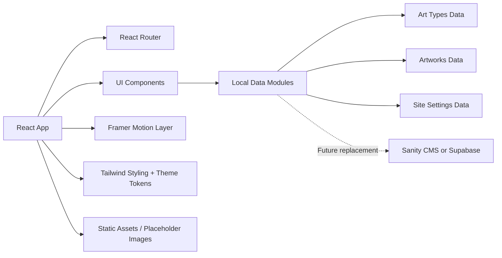
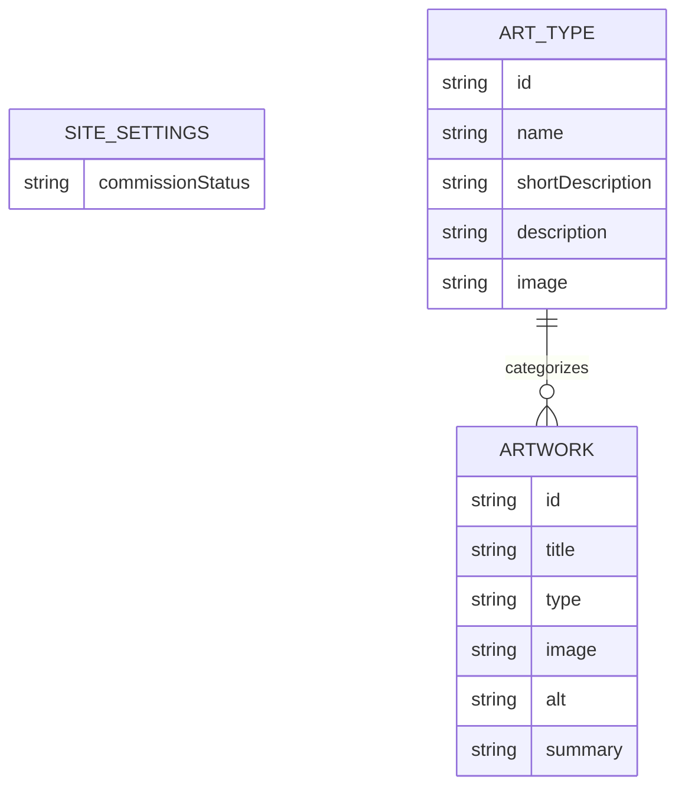

## 1. Architecture Design


## 2. Technology Description
- Frontend: React 18 + TypeScript + Vite
- Styling: Tailwind CSS with custom theme tokens and utility extensions
- Routing: React Router DOM
- Motion: Framer Motion
- Icons: Lucide React
- Data source: local TypeScript modules designed for future CMS replacement
- Deployment: Vercel with SPA rewrite configuration

## 3. Route Definitions
| Route | Purpose |
|-------|---------|
| / | Home page with intro animation, hero, shortcut cards, and art type carousel |
| /portfolio | Portfolio overview page with introductory copy and draggable art-type carousel |
| /portfolio?type=:type | Filtered portfolio experience for a selected art category |
| /tos | Terms of Service page with policy sections |
| /about | About page with artist profile and social links |

## 4. API Definitions
No backend API is required in the initial version.

The site uses local data modules:

```ts
export type CommissionStatus = "open" | "closed";

export interface SiteSettings {
  commissionStatus: CommissionStatus;
}

export interface ArtType {
  id: "character" | "chibi" | "sketch" | "l2d" | "other";
  name: string;
  shortDescription: string;
  description: string;
  image: string;
}

export interface Artwork {
  id: string;
  title: string;
  type: ArtType["id"];
  image: string;
  alt: string;
  summary: string;
}
```

## 5. Data Model
### 5.1 Data Model Definition


### 5.2 Data Definition Notes
- `src/data/siteSettings.ts` stores editable commission state for UI badges and future CTA conditions.
- `src/data/artTypes.ts` stores the five portfolio categories and route-compatible identifiers.
- `src/data/artworks.ts` stores image entries and metadata for filtered gallery rendering.
- Each data module includes comments noting that the local arrays can later be replaced by Sanity CMS fetchers or Supabase queries without changing page/component contracts.

## 6. Component Architecture
- `AppShell`: global background, navbar, routed page outlet, and shared ornament atmosphere
- `Navbar`: brand, route links, active state indicator, responsive menu behavior
- `PageTransition`: route-level motion wrapper using Framer Motion
- `IntroAnimation`: first-load cinematic intro respecting reduced-motion preferences
- `HeroCardCarousel` and `PortfolioTypeCarousel`: draggable category browsing using shared art type data
- `ShortcutCards`: stylized navigation shortcuts for ToS, About, and Commission Portfolio
- `ArtworkGrid`: responsive gallery with click/pointer-safe item interaction
- `ImageLightbox`: accessible modal with fixed overlay, escape handling, outside click dismissal, and scroll locking
- `BackButton`: navigation-aware reusable back action with route fallback
- `OrnamentLayer`: reusable visual decoration system for rings, lines, sparkles, and premium background details

## 7. Rendering and State Strategy
- Use route query parameters to drive selected portfolio type state
- Keep app state lightweight with React hooks only; no global state library is necessary
- Memoize filtered artwork lists where useful, but prefer simplicity over premature optimization
- Keep modal state local to the portfolio page or gallery container

## 8. Performance and Accessibility
- Use responsive image sizing and object-fit rules to preserve layout quality
- Respect `prefers-reduced-motion` for intro animation and page transitions
- Ensure keyboard dismissal of the modal with Escape and visible focus states on interactive elements
- Avoid hover-only interactions for artwork viewing and critical navigation
- Preserve touch usability with large tap targets and draggable horizontal content on mobile
